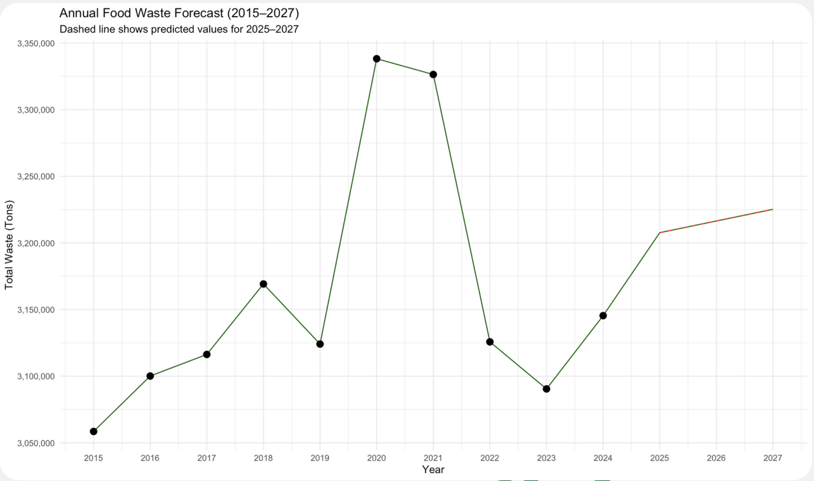
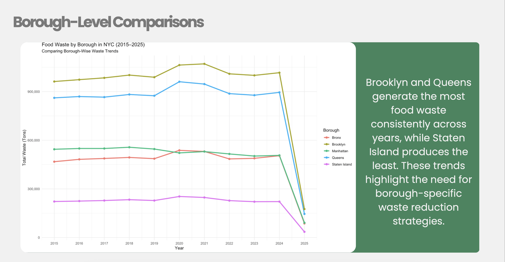
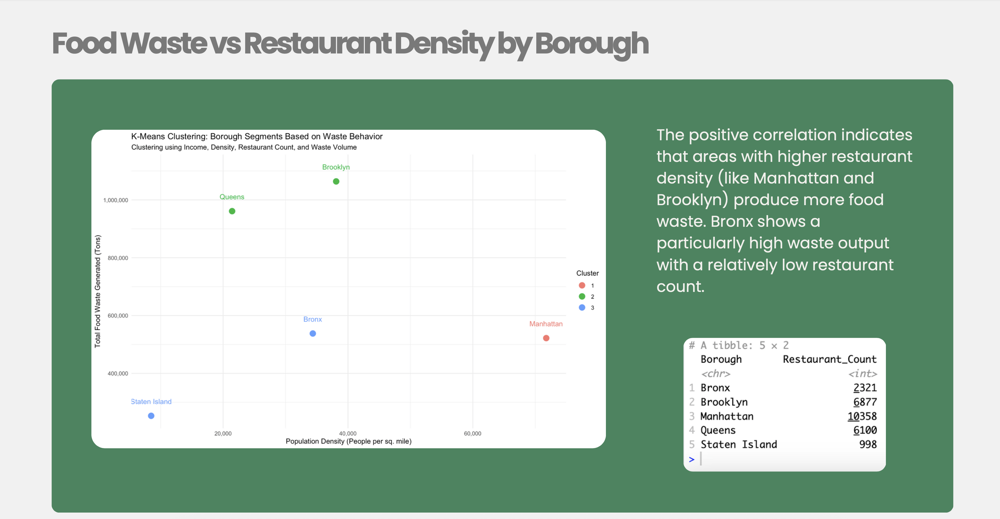

# NYC Food Wastage (2015–2025)

## Project Overview

New York City generates over **3 million tons of food waste** annually. Despite composting programs and redistribution efforts, borough-level waste trends remain inconsistent.

This project analyzes food waste patterns across NYC boroughs, models their relationship with income, population, and restaurant density, and recommends borough-specific interventions.

---

## 📚 Datasets

| File | Description |
|------|-------------|
| `data/DSNY_Monthly_Tonnage_Data.csv` | Monthly waste tonnage data by borough (2015–2025) |
| `data/DSNY_Other_Organics_Collection_Tonnages.csv` | Organic composting tonnage collected by DSNY |
| `data/ACSST1Y2023.S1901-Data.csv` | U.S. Census ACS: Borough-level median household income (2023) |

> Note: The restaurant inspection dataset was too large to upload, but insights were derived and included in the merged dataset.

---

## Tools & Data Sources

| Tool | Use |
|------|-----|
| **R** | Data wrangling, regression modeling, clustering |
| **Tableau** | Borough-level dashboards and visuals |
| **Excel** | Initial cleaning, pivoting, and verification |

## Methodology

- **EDA**: Borough-level trends (waste volume, composting rate)
- **Linear Regression**: To predict food waste by borough
- **Poisson Regression**: Confirmed count-based model reliability
- **K-Means Clustering**: Grouped boroughs by waste behavior
- **Correlation Analysis**: Tested relationships with socioeconomic variables

---

## Key Insights

| Finding | Insight |
|--------|---------|
| 📈 R² = 0.93 | Linear regression accurately predicted food waste volume |
| 🍽️ Restaurant density = strongest predictor | More restaurants → more food waste (corr = 0.45) |
| 💸 Income has a negative relationship | Lower-income boroughs generate more waste |
| 🏙️ Population density has a weak effect | Not a major standalone driver |
| ♻️ Composting inconsistent | Spikes in 2023, dip in 2024 — unstable participation |

---

## 📊 Visual Samples

### Annual Food Waste Forecast (2015–2027)
> Modeled using linear regression  
> RMSE ≈ 79,000 tons

---

### Borough Comparison of Waste (2015–2025)

---

### Restaurant Density vs Food Waste

---

## 📄 Files

### 📊 Final Project Deck  
📥 [Download PDF](https://github.com/nishtha-sood/nishtha-sood.github.io/raw/main/Proj%231%20-%20NYC%20Food%20Wastage%20Analysis/presentation/food-waste-presentation.pdf) 
🔗 [Open in new tab ↗](presentation/food-waste-presentation.pdf)

---

### 📜 R Script: Regression, Clustering, and Diagnostics  
📥 [Download food-waste-analysis.R](code/food-waste-analysis.R)

