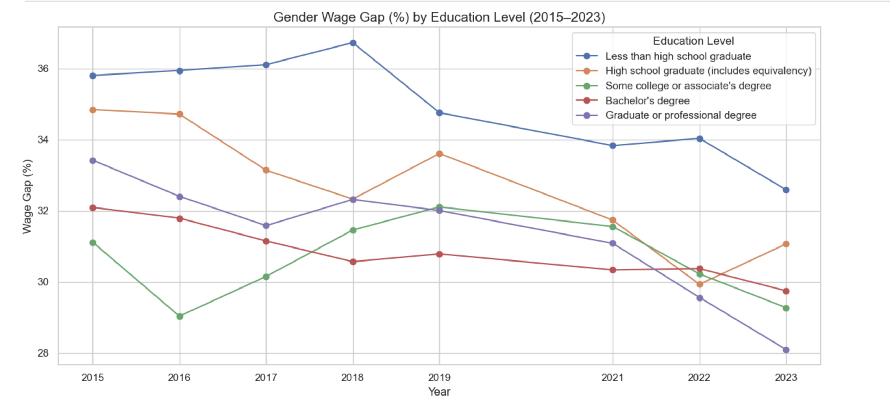
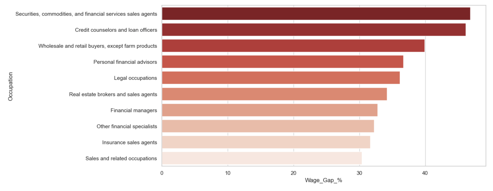

# Proj#2 - U.S. Gender Wage Gap Analysis

## Summary of Project

This project analyzes gender-based wage disparities in the United States between 2015 and 2023 using data from the U.S. Census Bureau’s ACS and the Current Population Survey. The focus is on exploring wage gaps by education level, occupation, and work arrangement.

Key goals include:
- Quantifying the wage gap across different education levels
- Identifying occupations with the highest gender-based wage differences
- Visualizing longitudinal trends and segment-specific patterns

**Part I – Data Collection**  
- Raw data sourced from the U.S. Census ACS: `ACSDT1Y2015–2023.B20004-Data.csv`
- 2024 data pulled from `cpsa2024.xlsx`
- Variables include: gender, education level, occupation group, and income

**Part II – Data Cleaning (`cleaning-wage-data.R`)**
- Cleaned nulls, standardized columns
- Created `wage_gap_percent` variable
- Aggregated wage data by education level and year for trend analysis

**Part III – Analysis & Visualizations (`gender_wage_gap_analysis.ipynb`)**
- Line plots showing change in wage gap by education level
- Heatmap for year-over-year breakdown
- Bar chart for occupations with highest wage gaps

---

## Datasets

| File | Description |
|------|-------------|
| `data/ACSDT1Y2015–2023.B20004-Data.csv` | ACS raw data files with gender-based income by education (2015–2023) |
| `data/cpsa2024.xlsx` | CPS data (2024) with similar structure |

---

## Visuals

### Gender Wage Gap (%) by Education Level (2015–2023)

### Heatmap of Wage Gap by Education & Year

### Wage Gap % by Occupation (2023)

---

## Files

### 📓 Notebook
- [`gender_wage_gap_analysis.ipynb`](code/gender_wage_gap_analysis.ipynb) — Full exploratory and statistical analysis

### 🌐 HTML Version
- [`gender_wage_gap_analysis.html`](code/gender_wage_gap_analysis.html) — Clean, viewable version of the notebook

## Acknowledgements
Data provided by:
- U.S. Census Bureau (ACS)
- U.S. Bureau of Labor Statistics (CPS)

