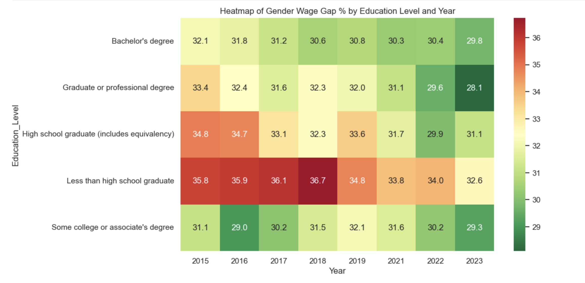

# Proj#2 - U.S. Gender Wage Gap Analysis

## Summary of Project

This project analyzes gender-based wage disparities in the United States using annual ACS data from 2016 to 2024. It focuses on differences in earnings between men and women across five educational levels — from less than high school to graduate/professional degrees — using Python for data processing and visualization.

Key goals include:
- Quantify wage disparities by gender across education levels over time.
- Identify which groups and years show the most pronounced wage gaps.
- Visualize trends to assess whether disparities are shrinking or persisting.
- Practice dynamic data cleaning and storytelling in Python.

**Part I – Data Collection**  
- Raw data sourced from the U.S. Census ACS: `ACSDT1Y2015–2023.B20004-Data.csv`
- 2024 data pulled from `cpsa2024.xlsx`
- Variables include: gender, education level, occupation group, and income

**Part II – Data Cleaning (`cleaning-wage-data.R`)**
- Cleaned nulls, standardized columns
- Created `wage_gap_percent` variable
- Aggregated wage data by education level and year for trend analysis

**Part III – Analysis & Visualizations (`gender_wage_gap_analysis.ipynb`)**
- Line plots showing change in wage gap by education level
- Heatmap for year-over-year breakdown
- Bar chart for occupations with highest wage gaps

**Python Tools Used**:  
   `pandas`, `matplotlib`, `seaborn`, `os`, `glob`

---

## Datasets

| File | Description |
|------|-------------|
| `data/ACSDT1Y2015–2023.B20004-Data.csv` | ACS raw data files with gender-based income by education (2015–2023) |
| `data/cpsa2024.xlsx` | CPS data (2024) with similar structure |

---

## Visuals

### Gender Wage Gap (%) by Education Level (2015–2023)

### Heatmap of Wage Gap by Education & Year
This heatmap highlights how wage gaps differ across educational levels and how they evolve over time.

> *Note: Darker shades = larger wage gaps*

### Wage Gap % by Occupation (2023)

---
## 📌 Insights

- Wage gaps **persist across all education levels**, with women earning 10–20% less than men on average.
- **Graduate degree holders** experience the largest absolute wage gaps.
- Despite modest improvements, **no education group has reached wage parity** over the 9-year span.

---

## Files

### 📓 Notebook
- [`gender_wage_gap_analysis.ipynb`](code/gender_wage_gap_analysis.ipynb) — Full exploratory and statistical analysis

### 🌐 HTML Version
- [`gender_wage_gap_analysis.html`](code/gender_wage_gap_analysis.html) — Clean, viewable version of the notebook

## Acknowledgements
Data provided by:
- U.S. Census Bureau (ACS)
- U.S. Bureau of Labor Statistics (CPS)

---

